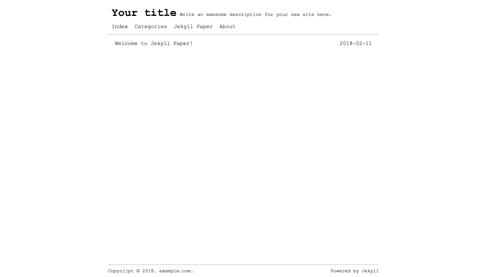
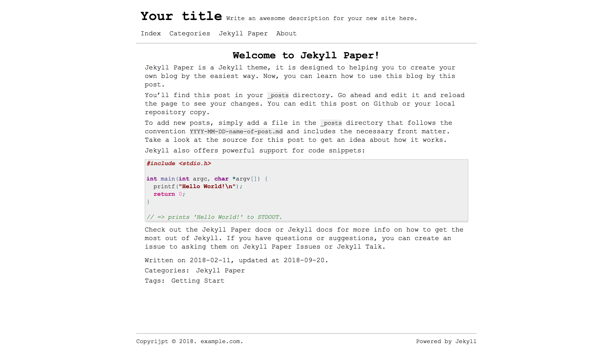
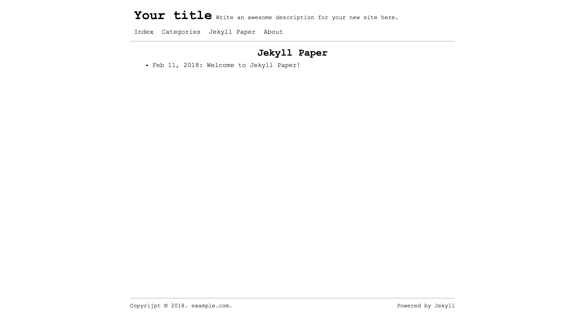
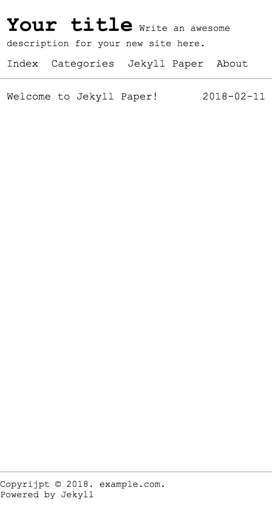

# Jekyll-Paper


English | [简体中文](./README-CN.md)

Jekyll Paper is a simple Jekyll theme, and it is aim to helping you to create your own blog by the easiest way.

Unfortunately, Jekyll Paper implement the category page by 'jekyll-archive' plugin, and GitHub Pages does not support it. So, this project is for self-host blog, and the Github Pages version is also available in [Jekyll Paper for Github][jekyll-paper-github].

This is a [demo website](https://www.ghosind.com) for Jekyll Paper.

## Features

- Responsive
- Paginate
- RSS
- Sitemap
- Custom 404 page
- SASS
- Internationalization
- Configurable navigation menu
- Categories Index
- SEO optimization
- Mathematics (MathJax)
- Diagrams (Mermaid)
- Comments (Disqus)

## Getting Start

Jekyll Paper is easy to create your own blog. You can create your blog by five steps only!

1. `$ gem install bundler jekyll`
2. `$ git clone git@github.com:ghosind/Jekyll-Paper.git`
3. `$ cd Jekyll-Paper`
4. `Jekyll-Paper $ bundle install`
5. `Jekyll-Paper $ bundle exec jekyll serve`

## Add New Posts

You can add new posts at any time after you had your own blog. Create a new post need to add a new file in "_posts" directory, and the file name must follow the convention `YYYY-MM-DD-name-of-post.md`.

## Custom Navigation Menu

You can add or update navigation menu items in `_data/menus.yml` file. In the configuration file, you need set title and URL for every navigation menu item.

### Example

```yml
- title: "Index"
  url:   ""

- title: "Github"
  absoluteUrl: true
  url: "https://github.com/john_doe"

- title: "About"
  url:   "about"
```

## Supported Languages

Jekyll Paper has supported the following languages, please set language in `language` section of `_config.yml` file (default `language: en`). I'm anticipating you to help me improve the quality of translations and add more languages. The languages list by alphabets of its language code.

- English
- Deutsche (German)
- Español (Spanish)
- Français (French)
- 日本語 (Japanese)
- Português (Portuguese)
- 简体中文 (Simplified Chinese)
- 繁體中文 (Traditional Chinese)

## Screenshots

The home page:



The post page:



The category page:



The home page in mobile version:



## License

Jekyll Paper was released under MIT license.

## Contributing

If you would like to make Jekyll Paper better, you can create a new pull request in [Jekyll Paper Github Page][jekyll-paper].

If you have any questions or suggestions, you can create an issue on [Jekyll Paper Issues][jekyll-paper-issues].

[jekyll-paper]: https://github.com/ghosind/Jekyll-Paper
[jekyll-paper-github]: https://github.com/ghosind/Jekyll-Paper-Github
[jekyll-paper-issues]: https://github.com/ghosind/Jekyll-Paper/issues
